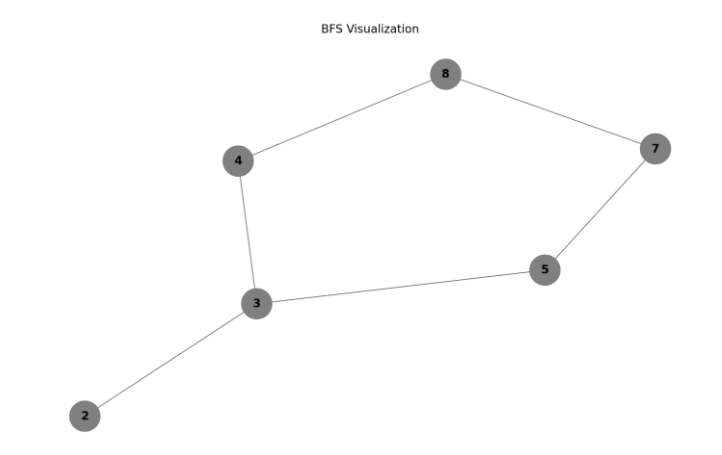
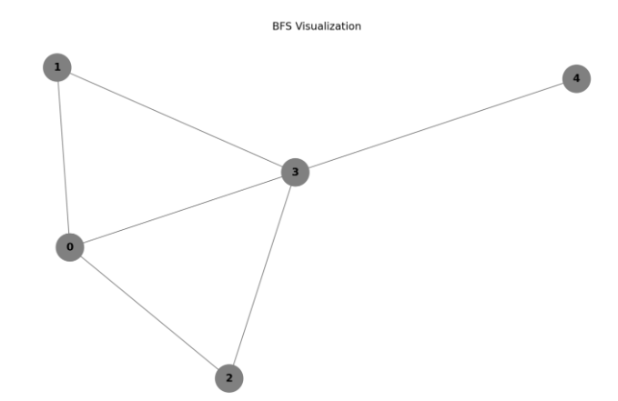

Code implementation can be found at: https://bfs-in-detail.streamlit.app/

# Breadth First Search
**Q. Given a starting vertex in a graph, find the shortest path to every other vertex in the graph, which algorithm can be used to solve this?**
These sort of questions can be solved using BFS algorithm.
***
## Overview
1. Intuition behind BFS
2. Implementation
***
## 1. Intuition behind BFS


1. Envision these nodes as tennis balls, with node 2 as our initial point.
2. Upon picking up Ball 2, the strings connecting the balls tighten.
3. It becomes immediately apparent that the shortest paths between ball 2 and the other balls are clear.
4. Consequently, our approach involves sequentially exploring 1st degree neighbors, followed by 2nd degree neighbors, 3rd degree, and so forth...

The key advantage offered by BFS lies in its ability to determine the shortest distance between any two nodes within the graph.

## BFS Implementation
*Pseudocode:*
```python
marked = [False] * G.size()

def bfs(G, v):
    queue = [v]
    while queue:
        v = queue.pop(0)
        if not marked[v]:
            visit(v)
            marked[v] = True
            for w in G.neighbors(v):
                if not marked[w]:
                    queue.append(w)
```


1. `marked = [False] * G.size()`: This line creates a list called `marked` of size `G.size()` (where `G` is the graph) and initializes all its elements to `False`. This list will be used to keep track of whether a node has been visited during the BFS traversal.

2. `def bfs(G, v)`: This defines the BFS function which takes two parameters: the graph `G` and the starting node `v`.

3. `queue = [v]`: Initialize a queue with the starting node `v`. The queue will be used to keep track of nodes to be visited next.

4. `while queue:`: This initiates a loop that continues as long as the queue is not empty. In other words, the loop will run until all nodes have been visited.

5. `v = queue.pop(0)`: Retrieve and remove the first node from the queue (`v`), simulating a FIFO (First-In-First-Out) behavior. This means we are processing nodes in the order they were added to the queue.

6. `if not marked[v]:`: Check if the current node `v` has not been marked as visited. If it hasn't been visited, we proceed to visit it.

7. `visit(v)`: Perform the "visit" operation on node `v`. This is where you would perform whatever action you need to on the visited node (e.g., print it, process its data, etc.).

8. `marked[v] = True`: Mark the current node `v` as visited by setting its corresponding entry in the `marked` list to `True`.

9. `for w in G.neighbors(v):`: Iterate through the neighbors of the current node `v`.

10. `if not marked[w]:`: Check if the neighbor node `w` has not been marked as visited. If it hasn't been visited, add it to the end of the queue.

11. `queue.append(w)`: Add the unvisited neighbor node `w` to the end of the queue. This ensures that it will be processed in the future iterations of the loop.

This process continues until the queue becomes empty, indicating that all reachable nodes have been visited. The BFS traversal explores nodes level by level, starting from the initial node and moving outward in a systematic manner, which guarantees that the shortest paths to all nodes from the starting node are determined.

**Example:**


**Step 1:**
- bfs(G,0)
- queue: |0|
- popping off the first entry
- visited: [0]
- Order: ==0==


**Step 2**
- neigbors of parent node: 1 2 3
- unmarked: 1 2 3
- queue: |1| 2| 3|
- popping off the first entry
- visited: [1]
- Order: ==0 1==


**Step 3**
- neigbors of parent node: 0 3
- unmarked: 3
- queue: |2| 3| 3|
- popping off the first entry
- visited: [2]
- Order: ==0 1 2==


**Step 4**
- neigbors of parent node: 0 3
- unmarked: 3
- queue: |3| 3| 3|
- popping off the first entry
- visited: [3]
- Order: ==0 1 2 3==
 
**Step 5**
- neigbors of parent node: 0 1 2 4
- unmarked: 4
- queue: |3| 3| 4|
- popping off the first entry
- visited: [ ] # stays empty as 3 has already been visited before
- Order: ==0 1 2 3==


**Step 6**
- neigbors of parent node: -
- unmarked: -
- queue: | 3| 4|
- popping off the first entry
- visited: [ ] # stays empty as 3 has already been visited before
- Order: ==0 1 2 3==


**Step 7**
- neigbors of parent node: -
- unmarked: -
- queue: | 4|
- popping off the first entry
- visited: [4 ] 
- Order: ==0 1 2 3 4==

***
## Basic Code Implementation

```python
graph = {
    '5': ['3', '7'],
    '3': ['2', '4'],
    '7': ['8'],
    '2': [],
    '4': ['8'],
    '8': []
}

visited = []
queue = []

def bfs(visited, graph, node):
    visited.append(node)
    queue.append(node)
    while queue:
        m = queue.pop(0)
        print(m, end=" ")
        for neighbour in graph[m]:
            if neighbour not in visited:
                visited.append(neighbour)
                queue.append(neighbour)

print("Following is the Breadth-First Search")
bfs(visited, graph, '5')
```

1. `graph`: This dictionary represents the graph where the keys are nodes, and the values associated with each node are its neighboring nodes. For example, node '5' has neighbors '3' and '7'.

2. `visited`: This is a list that will store the nodes that have been visited during the BFS traversal.

3. `queue`: This is a list that will be used as a queue to keep track of nodes that need to be visited in the future.

4. `bfs(visited, graph, node)`: This is the BFS traversal function that takes three parameters: the `visited` list, the `graph`, and the starting `node`.

5. `visited.append(node)`: The starting node is marked as visited and added to the `visited` list.

6. `queue.append(node)`: The starting node is also added to the end of the queue.

7. `while queue:`: This initiates a loop that continues as long as the queue is not empty. This loop processes nodes one by one in the order they were added to the queue.

8. `m = queue.pop(0)`: The first node in the queue is removed (pop operation) and stored in the variable `m`. This simulates the FIFO behavior of a queue.

9. `print(m, end=" ")`: The current node `m` is printed (with a space at the end to format the output).

10. `for neighbour in graph[m]:`: This iterates through the neighboring nodes of the current node `m`.

11. `if neighbour not in visited:`: If the neighbor `neighbour` has not been visited yet, we proceed to visit it.

12. `visited.append(neighbour)`: The neighbor node is marked as visited and added to the `visited` list.

13. `queue.append(neighbour)`: The neighbor node is also added to the end of the queue for future processing.

14. The loop continues to process nodes in a breadth-first manner until the queue becomes empty, meaning all reachable nodes have been visited.

15. The final result is a Breadth-First Search traversal of the given graph starting from node '5', which prints the visited nodes in the order they were traversed.
